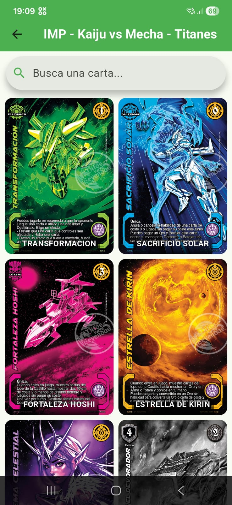
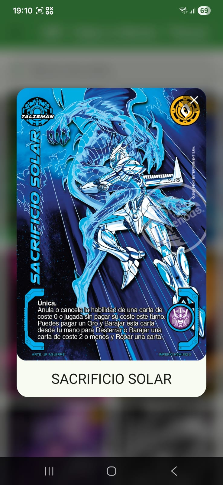

# Mitos y Leyendas App


Aplicación móvil desarrollada en **Flutter** para explorar cartas del juego de cartas coleccionables chileno **Mitos y Leyendas**, formato **Imperio**.

Consume la API oficial de [myl.cl](https://api.myl.cl) y permite buscar cartas en tiempo real, filtrar por edición y ver el detalle de cada carta con animaciones.

---

## 🎯 Objetivo del proyecto

Este proyecto tiene fines educativos y de portafolio, enfocado en:

- Aplicar **Clean Architecture** en una app Flutter real
- Gestión de estado avanzada con **Riverpod**
- Optimización de rendimiento: caché de imágenes y caché HTTP
- Buenas prácticas de UI/UX con **Material 3**

---

## ✨ Características

- 🔍 Búsqueda de cartas en tiempo real con filtrado en cliente
- 🃏 Filtrado por edición sin requests adicionales a la API
- 📄 Vista detallada de cada carta con diálogo animado
- 🎞 Animaciones con Hero entre pantallas
- ⚡ Estado reactivo con Riverpod
- 🖼 Caché de imágenes con `cached_network_image`
- 💾 Caché HTTP de respuestas con `dio_cache_interceptor`

---

## 📸 Capturas

<p align="center">
  
  &nbsp;&nbsp;&nbsp;
  
</p>
<p align="center">
  <sub>Búsqueda de cartas &nbsp;&nbsp;&nbsp;&nbsp;&nbsp;&nbsp;&nbsp;&nbsp;&nbsp;&nbsp;&nbsp;&nbsp;&nbsp;&nbsp;&nbsp;&nbsp;&nbsp;&nbsp; Detalle de carta</sub>
</p>

---

## 🛠 Tecnologías

| Tecnología                                                              | Uso                                  |
| ----------------------------------------------------------------------- | ------------------------------------ |
| [Flutter 3.x](https://flutter.dev)                                      | Framework UI multiplataforma         |
| [Riverpod 3.x](https://riverpod.dev)                                    | Gestión de estado                    |
| [Dio 5.x](https://pub.dev/packages/dio)                                 | Cliente HTTP                         |
| [dio_cache_interceptor](https://pub.dev/packages/dio_cache_interceptor) | Caché de respuestas HTTP             |
| [cached_network_image](https://pub.dev/packages/cached_network_image)   | Caché y carga optimizada de imágenes |
| [go_router](https://pub.dev/packages/go_router)                         | Navegación declarativa               |
| [shimmer](https://pub.dev/packages/shimmer)                             | Skeletons de carga                   |
| Material 3                                                              | Sistema de diseño                    |

---

## 🧱 Arquitectura

El proyecto sigue **Clean Architecture**, separando responsabilidades en tres capas bien definidas:

```
lib/
├── config/
│   ├── router/          # Configuración de rutas con go_router
│   └── theme/           # Tema global de la app (Material 3)
│
├── domain/
│   ├── entities/        # Modelos de negocio (CardEntity, EditionEntity)
│   └── repositories/    # Contratos (interfaces) de repositorio
│
├── infrastructure/
│   ├── datasource/      # Llamadas HTTP a api.myl.cl
│   ├── mappers/         # Conversión entre modelos de API y entidades de dominio
│   ├── repositories/    # Implementaciones concretas de los contratos
│   └── services/        # Configuración de Dio (timeouts, caché, logging)
│
├── presentation/
│   ├── provider/
│   │   ├── card/        # Providers de cartas, filtrado y búsqueda
│   │   └── edition/     # Provider de edición seleccionada
│   ├── screens/
│   │   ├── cards/       # Pantalla de listado de cartas
│   │   └── editions/    # Pantalla de selección de edición (home)
│   └── widgets/
│       ├── cards/       # CardImage, GridView, diálogo de detalle
│       ├── edition/     # Lista animada de ediciones
│       └── shared/      # AppBar, SearchAnchor, filtros reutilizables
│
└── main.dart
```

El estado se gestiona **exclusivamente con Riverpod**. La UI nunca accede directamente a la capa de datos — siempre pasa por un provider.

### Flujo de datos

```
UI (widgets)
   ↓ observa
Providers (Riverpod)
   ↓ delegan
Repositorio (dominio)
   ↓ implementado por
Datasource (infraestructura)
   ↓ usa
Dio + caché HTTP → api.myl.cl
```

---

## ⚡ Optimizaciones de rendimiento

### Caché de imágenes

Las imágenes de cartas se almacenan en disco con `cached_network_image`. Al navegar entre pantallas, las imágenes ya descargadas aparecen instantáneamente sin volver a la red.

### Caché HTTP

Las respuestas de la API se guardan en memoria RAM durante 30 minutos con `dio_cache_interceptor`. Si el usuario vuelve a una edición ya consultada, los datos se sirven desde caché sin ninguna llamada HTTP.

### Filtrado en cliente

La búsqueda y el filtro por edición operan sobre los datos ya en memoria. Cambiar el texto del buscador o la edición seleccionada no genera ningún request adicional a la API.

### Providers persistentes

Los providers de cartas usan `ref.keepAlive()`, lo que evita que Riverpod destruya el estado al salir de una pantalla y lo vuelva a cargar al regresar.

---

## 🚀 Instalación

1. Clona el repositorio:

   ```bash
   git clone https://github.com/BastianDevs/mitos_y_leyendas_app.git
   ```

2. Instala dependencias:

   ```bash
   flutter pub get
   ```

3. Ejecuta la app:

   ```bash
   flutter run
   ```

> Requiere Flutter 3.x y Dart 3.x. Probado en Android e iOS.

---

## 🗺️ Roadmap

### ✅ Completado

- [x] Arquitectura limpia con Riverpod
- [x] Listado de cartas por edición
- [x] Búsqueda en tiempo real con filtrado en cliente
- [x] Filtro reactivo mediante providers derivados
- [x] Vista de detalle de carta con diálogo animado
- [x] Caché de imágenes con `cached_network_image`
- [x] Caché HTTP de respuestas con `dio_cache_interceptor`
- [x] Providers persistentes con `ref.keepAlive()`
- [x] Manejo de estados de error y empty states en grid y buscador
- [x] Skeleton loaders con shimmer en grid y sugerencias de búsqueda
- [x] Animaciones Hero entre grid y dialog de detalle

### 🔜 Planificado

- [ ] Favoritos de cartas
- [ ] Filtros avanzados (tipo, coste, rareza)
- [ ] Caché local persistente para modo offline (Isar)
- [ ] Tests unitarios de providers
- [ ] Modo oscuro completo

---

## 📄 Licencia

Este proyecto está bajo la licencia MIT.
Consulta el archivo [LICENSE](LICENSE) para más detalles.
